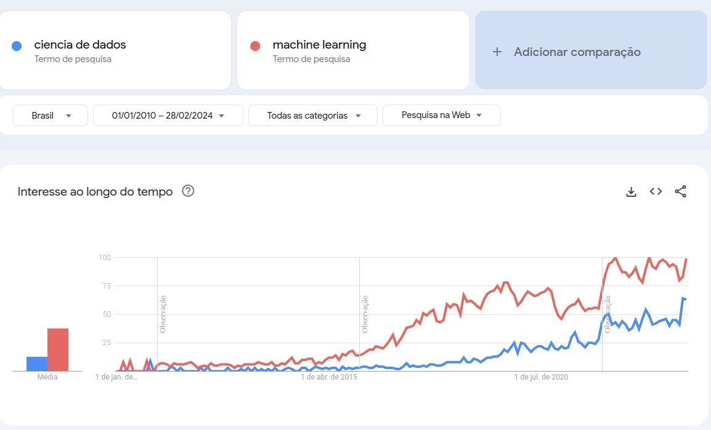

# **Dive into data careers**

 

 Desde a pandemia vivenciamos noticias como: [Brasil terá déficit de 530 mil profissionais de tecnologia até 2025, mostra estudo do Google](https://g1.globo.com/trabalho-e-carreira/noticia/2023/05/31/brasil-tera-deficit-de-530-mil-profissionais-de-tecnologia-ate-2025-mostra-estudo-do-google.ghtml) e os ditos "influenciadores", coaches e vendedores de curso prometendo altos ganhos de salários de forma rápida e com pouco esforço, impulsionando ainda mais o mercado de tecnologia que tem tido uma busca expressiva por parte das pessoas. 

 Nesse contexto, uma das áreas que mais tem se destacado é a área de dados. Com a explosão da quantidade de dados disponíveis e a crescente necessidade de extrair insights significativos deles, a demanda por profissionais qualificados em dados nunca foi tão alta. A promessa de carreiras lucrativas e repletas de oportunidades atrai cada vez mais pessoas em busca de atualização profissional e sucesso financeiro. Na imagem a seguir, apresentamos os dados referentes às buscas pelos termos "machine learning" e "ciencia de dados" no google, e podemos notar a clara tendência de crescimento iniciando em meados de 2016/2017 e o seu máximo em 2022/2024. 

A tomada de decisões assertivas em um mercado tão aquecido como o que estamos atualmente pode ser desafiadora, principalmente quando consideramos a quantidade de informações que nos chegam a todo momento sobre a área. Diante desse cenário, surge a necessidade de uma compreensão mais aprofundada acerca das carreiras em dados. 

Desse modo, **"Dive into data careers"** é um projeto de análise de dados que busca oferecer insights que auxiliem indivíduos e profissionais a tomarem decisões mais assertivas.

---
# **Dados**

Para esse projeto utilizamos o dataset [Data Science Salaries 2024](https://www.kaggle.com/datasets/sazidthe1/data-science-salaries) onde, de acordo com o autor, os dados foram extraídos do site de empregos internacional [ai-jobs](https://ai-jobs.net/). Essa informação foi extraída dos metadados do dataset no Kaggle.

Utilizou-se também o arquivo [countries.csv](https://developers.google.com/public-data/docs/canonical/countries_csv) para complementar a base com dados geográficos.

---
# **Objetivo**

A presente análise busca compreender quais são as carreiras de dados mais promissoras. Para tal, definiremos uma série de objetivos parciais listados a seguir:

* Buscamos entender como o efeito temporal modificou a
    * Criação de novos cargos e demanda por profissionais
    
    * Evolução salarial

* Entender a distribuição de salários dos profissionais da área

* Avaliar como o nível de experiencia de um individuo impacta em seu salário

* Investigar como o modelo de trabalho (remoto, híbrido, presencial) está relacionado com o salário

* Verificar se a localização geográfica de um individuo/empresa reflete no salario

* Compreender se o tamanho da empresa está associado ao salario.

---
# **Motivação**

O desenvolvimento deste trabalho é motivado e incentivado pelo clube de assinaturas da Universidade dos Dados pelo André Yukio através de uma competição que visa selecionar as melhores análises acerca do tema proposto. 

---
# **Observação**

 Em algumas etapas da análise há mapas interativos, todavia, o git hub por si só não renderiza esse tipo de conteúdo. Dito isso, é altamente recomendável utilizar o nbviewer para a renderização correta.

 [Link para o notebook no nbviewer para a renderização de mapas interativos](https://nbviewer.org/github/Alexandre-Esposte/dive-into-data-careers/blob/master/notebook/data_careers_analysis.ipynb)